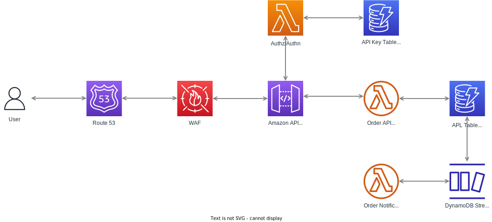

# Introduction 

## AWS Architecture

- **Route 53:** Sets up DNS for the environment
- AWS WAF: Protects our applications from known threats such as DDoS and cross-site scripting
- **AWS API Gateway:** Bundles our Lambdas together in a single URL and routes them to the correct AWS Lambda
- **Authn/Authz Functions:** Ideally, some kind of authentication should be used to identify users who are accessing the orders
- **Order API Functions:** Used for handling CRUD operations
- **APL Table:** DynamoDB Table used to store multiple entities in our APL order domain (Orders, Lockers, etc)
- **Order Notification functions:** Handle changes from DynamoDB streams from the ATL Table. They could implement different types of notifications depending on requirements (i.e email using AWS SES, Webhooks API, Websockets).

Ideally, all AWS components such as Route 53, AWS WAF, and DynamoDB tables should be created using an Infrastructure as Code (IaC) approach, using tools such as Terraform or AWS CDK.

I would create another repository with those configurations as a monorepo that could have abstract constructs where multiple teams could collaborate.
This usually works better when you have a dedicated Platform Team, responsible for assisting teams in building scalable, secure, and reusable infrastructure from an organization standpoint.
Those infrastructure constructs could be easily accessed by Serverless Framework using SSM Parameters. You can find more about this pattern [here](https://www.serverless.com/blog/definitive-guide-terraform-serverless/). 

The functions are implemented inspired by Clean Architecture by Uncle Bob. Since the changes from requirements are constant when building products, isolating components into an onion-like architecture makes the software easier to test and maintain (since changing from AWS Lambda to Fargate would only cost rewriting platform specific logic and re-use the use cases).

# Development

## Installation/deployment instructions

**Requirements**:
- NodeJS `lts/gallium (v.16.20.0)`. If you're using [nvm](https://github.com/nvm-sh/nvm), run `nvm use` to ensure you're using the same Node version in local and in your lambda's runtime.
- Yarn `npm i -g yarn`
- Serverless Framework `npm i -g serverless`

### Using Yarn
- Run `yarn` to install the project dependencies

### Locally
We use [serverless-offline plugin](https://www.serverless.com/plugins/serverless-offline) for local development.

You can start all functions locally in your machine by running `yarn run dev`.

> We create also a local instance of dynamodb for development purposes, however the serverless-dynamodb-local plugin has a solved issue that 
was not pushed to npm yet [see](https://github.com/99x/serverless-dynamodb-local/issues/294)

# Deploying
Ideally a CD pipeline would deploy changes to **Staging** and **Production** depending on which branch the change has been merged (also after running other checks, i.e unit tests, linter, etc).

Right now this process is done from your machine. Make sure you create a environment variable `AWS_PROFILE` for setting up the AWS credentials used to deploy the functions (you can find them in your `~/.aws/credentials` file).

- **Staging**: `yarn run deploy:staging`
- **Production**: `yarn run deploy:production`

## Project structure

The project code base is mainly located within the `src` folder. This folder is divided in:

- `functions` - containing code base and configuration for your lambda functions
- `libs` - containing shared code base
- `use-cases` - Handles core functionallity for a giving use case, it is non-dependent from platforms (web/cli/etc)
- `models` - containing core objects to serialize/deserialize items from DynamoDB
- `repositories` - containing logic hiding implementation details for accesing data.

### 3rd party libraries

- [json-schema-to-ts](https://github.com/ThomasAribart/json-schema-to-ts) - uses JSON-Schema definitions used by API Gateway for HTTP request validation to statically generate TypeScript types in your lambda's handler code base
- [middy](https://github.com/middyjs/middy) - middleware engine for Node.Js lambda. This template uses [http-json-body-parser](https://github.com/middyjs/middy/tree/master/packages/http-json-body-parser) to convert API Gateway `event.body` property, originally passed as a stringified JSON, to its corresponding parsed object
- [@serverless/typescript](https://github.com/serverless/typescript) - provides up-to-date TypeScript definitions for your `serverless.ts` service file
